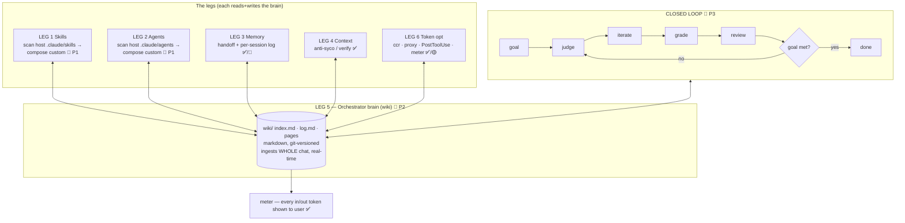
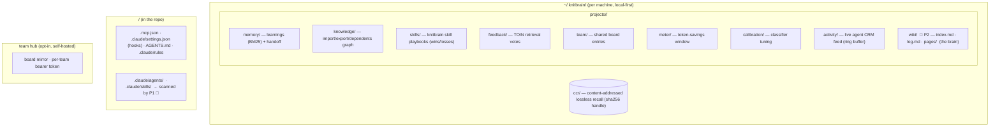
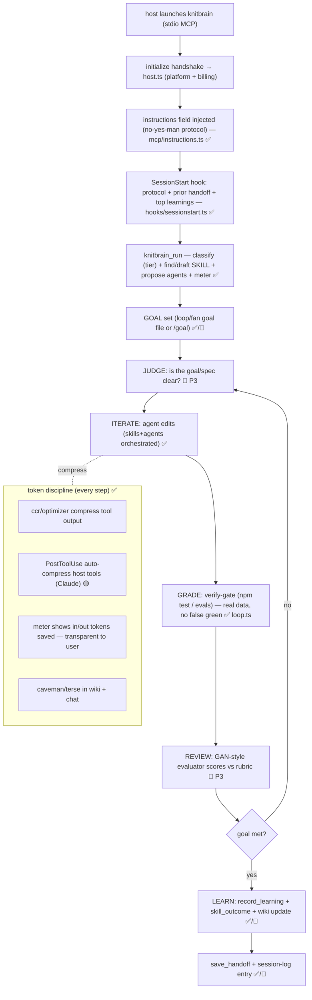

# knitbrain — Architecture (current + orchestrator target)

> Review doc. Maps the **whole codebase**, **every tool and what it does inside**, the **data stores**, the **closed-loop runtime**, and the **orchestrator target** (6 legs + closed loop + wiki-brain). Status tags: ✅ shipped (npm `knitbrain` ≤0.4.6) · 🟡 in-branch / built-but-unverified-live · 🔭 planned (P1→P3).
>
> Scope note: this doc is about **knitbrain** (`/Users/piyushdua/knit-brain`, npm `knitbrain`). It is **not** engram / `knit-mcp` (a separate product). We build only here.

---

## 1. What knitbrain is (one paragraph)

knitbrain is a **local-first MCP orchestrator** that gives any coding agent (Claude Code, Copilot, Cursor, Codex, Windsurf, …) six connected capabilities — **skills**, **agents**, **memory**, **anti-sycophantic context discipline**, a compounding **wiki-brain**, and **token/context optimization** — wired into a **closed autonomous loop** (goal → judge → iterate → grade → review → repeat). Everything is local (`~/.knitbrain/`), lossless, real-data (no mocks), and token-metered transparently. The MCP tool surface is universal across hosts; the deepest levers (auto-compression of host tool output, real meter/quota, sub-agent closed loop) run deepest on **Claude Code and Copilot**, degrading gracefully to the universal MCP core elsewhere.

---

## 2. The six legs + the closed loop (target topology)

**Invariant (the brain rule):** the brain ingests **everything from first prompt to session end** — not only data that flows through MCP tools. Each leg reads from and writes to the brain; the brain keeps freshness across all sessions. Caveman/terse applies **in the wiki and in chat** to save tokens on both ends.

---

## 3. The five code domains (every file belongs to exactly one)

Source of truth: `knit-brain/CLAUDE.md`. 27 MCP tools · 7,314 lines · 3 deps (`@modelcontextprotocol/sdk`, `@vscode/tree-sitter-wasm`, `gpt-tokenizer`).

| Domain | Dir | Responsibility | Key files |
|---|---|---|---|
| **1 CLI** | `src/index.ts`, `src/{setup,wrap,loop,fan,profile,evals,learn,compress-file,dashboard}.ts` | commands, arg parsing, MCP stdio boot, dashboard | `index.ts` (entry + all subcommands), `setup.ts` (one-time config), `loop`/`fan` (outer loop) |
| **2 Engine** | `src/engine/*` | core intelligence | `memory`, `knowledge` (code-graph), `skills`, `agents`, `teams`, `meter`+`usage`+`quota`, `calibration`, `feedback`, `activity`, `workflow` (tier classifier) |
| **3 Optimizer / CCR** | `src/optimizer/*`, `src/ccr/*`, `src/tokenizer.ts` | lossless compression | `router` (detect→route→compress), `ast`/`code`/`text`/`structured`/`json` (handlers), `params` (sweepable knobs), `ccr/store` (content-addressed recall) |
| **4 MCP + hooks + proxy** | `src/mcp/*`, `src/hooks/*`, `src/proxy/*`, `src/hub/*` | the surfaces every agent talks to | `mcp/{server,tools,host,instructions}`, `hooks/{sessionstart,pretooluse,posttooluse,index}`, `proxy/{server,optimize-request,cache-aligner}`, `hub/{client,server}` |
| **5 QA** | `tests/*`, `scripts/*`, `benchmarks` (via `evals`/`measure`) | coverage, evals, bench | `tests/*.test.ts` (50 files, 300 tests), `evals.ts` (answer-preservation), `measure.ts`+`scripts/bench.ts` |

`src/paths.ts` is the single source of truth for every storage path (honors a test override). `src/lib.ts` is the public programmatic API (`createOptimizer`).

---

## 4. Data stores

---

## 5. Runtime — the closed loop (target, every session)

**Enforcement physics (verified):** an MCP server only sees its own tool calls. So (1) the `instructions` field and (2) the MCP tool responses work on **every** host; (3) deterministic hooks (`SessionStart`/`PreToolUse`/`PostToolUse`) are **Claude-Code-only**; (4) real meter/quota is Claude (OAuth) + Copilot (quota), walled elsewhere → honest fallback.

---

## 6. Every tool — what happens inside (27 tools, grouped)

| Group | Tools | Inside |
|---|---|---|
| **Compression / CCR** ✅ | `knitbrain_read`, `knitbrain_optimize`, `knitbrain_retrieve`, `knitbrain_metrics`, `knitbrain_context_meter` | route→compress (lossless skeleton + `⟨recall:HASH⟩`), restore exact original, ccr/feedback/calibration rollup, token-window read · `optimizer/router` + `ccr/store` + `meter` |
| **Memory** ✅ | `record_learning`, `search_learnings`, `get_learning`, `learning_outcome`, `save_handoff`, `load_session` | learnings (BM25, outcome-ranked), handoff persist/restore · `engine/memory` |
| **Knowledge graph** ✅ | `scan`, `query_imports`, `query_exports`, `query_dependents` | import/export/dependents edges, blast-radius · `engine/knowledge` |
| **Workflow** ✅ | `classify_task`, `run`, `record_false_positive` | tier classify (inquiry/trivial/standard/complex) + phases; `run` = orchestrator entrypoint · `engine/workflow` |
| **Skills** ✅ | `skill_save`, `skill_outcome` | persist/score playbooks (wins/losses/health) · `engine/skills`. **🔭 P1 adds: scan host `.claude/skills`, compose custom** |
| **Agents** ✅ | `propose_agents`, `create_agent` | graph-driven proposals; write guardrailed `.claude/agents/<n>.md` · `engine/agents`. **🔭 P1 adds: scan host `.claude/agents`, compose in user's style** |
| **Team** ✅ | `team_post`, `team_board`, `team_get`, `team_clear` | shared board (compressed + recall), hub mirror · `engine/teams` + `hub/client` |
| **Meta** ✅ | `ping` | health + version |

All 27 now have direct handler tests (the 14 previously-untested were covered this session). `inputSchema` is advertised but not server-enforced (low-level SDK) — fine for local stdio; enforce at dispatch only if a remote transport is added.

---

## 7. The phased build (real-data verification gates per phase)

Build order is locked: **P1 setup-scan → P2 wiki-brain → P3 closed-loop.** Each phase ships only when its gate passes with **captured real output** (no mocks, no asserted-green).

### P1 — Existing-setup scan + custom composition (legs 1+2) 🔭 *first, smallest, concrete*
- **New:** `src/engine/host-scan.ts` — at `knitbrain setup`, read the host's `.claude/skills/*/SKILL.md` and `.claude/agents/*.md`; parse each (name, triggers, frontmatter, body/composition style).
- **Wire:** register scanned skills/agents into knitbrain's stores so they're **visible** (dedupe vs knitbrain's own); learn the composition style so `create_agent`/new `compose_skill` produce artifacts **consistent with how the user writes theirs**.
- **Surface:** `knitbrain_run` reports "found N existing skills, M agents; composed K project-tailored" instead of proposing from scratch.
- **Gate:** unit tests for parser (real SKILL.md/agent.md fixtures), e2e that scans a seeded `.claude/skills`+`.claude/agents` and asserts knitbrain surfaces + composes from them, 4 gates green. Scope ~1–2 sessions.

### P2 — Wiki-brain + session log (leg 5 + leg 3 gap) 🔭 *the centerpiece*
- **New:** `~/.knitbrain/projects/<id>/wiki/` = `index.md` (catalog) + `log.md` (append-only `## [date] event | title`) + `pages/` (entity/concept/summary). Ingests the **whole chat**, not just MCP-flow.
- **Real-time:** each input/output updates the wiki (via hook + MCP write path); user can watch (dashboard panel renders the wiki + graph of links).
- **Operations:** ingest (read source → summary page → update index + cross-refs + log), query (read index → drill pages → answer, file good answers back), lint (contradictions, stale claims, orphans).
- **Memory leg 3:** the `log.md` IS the structured per-session log; cross-session context surfaces from it at `load_session`.
- **Gate:** ingest a real session transcript → assert index/log/pages updated + cross-refs present; lint catches a seeded contradiction; caveman/terse keeps pages compact (token-measured). Multi-session.

### P3 — Closed-loop orchestrator (goal→judge→iterate→grade→review→repeat) 🔭
- **New:** inner GAN-style loop on top of `loop.ts`/`fan.ts`: a **judge** (goal/spec clarity), a **grade** (verify-gate, already real), a **review** (evaluator scores vs rubric), repeat until goal met.
- **Orchestration:** by **project intensity** (tier classifier) → assemble the right skills+agents and run the loop; token-budgeted at each step (compress between steps, meter shown).
- **Gate:** a real goal file driven to "met" through ≥2 judge/grade/review cycles with **real tokens measured live** (not pre-counted), no false green, full audit trail in the wiki. Builds on verified P1+P2.

---

## 8. Platform scope (verified in `setup.ts` / `platforms.ts`)

| Capability | Claude Code | Copilot | Cursor / Codex / Windsurf |
|---|---|---|---|
| MCP tools (skills/agents/memory/**wiki-brain**) | ✅ | ✅ | ✅ universal |
| Auto-compress host tool output (PostToolUse) | ✅ 🟡 | ✗ | ✗ |
| Real meter / quota | ✅ OAuth | ✅ quota | fallback |
| Deterministic hooks (drift/session) | ✅ | partial | MCP-instructions only |
| Sub-agent spawn (closed loop) | ✅ Task | varies | varies |

**Decision:** build + **live-verify depth on Claude Code and Copilot first**; the universal MCP core (legs 1,2,3,5) reaches the rest automatically. No lowest-common-denominator dilution.

---

## 9. Token discipline + transparency (leg 6, the throughline)

- **Lossless compression** of tool output (ccr + optimizer), gated by `evals` (round-trip 100%, never-expand) and `bench` (68% weighted) — both verified green this session.
- **API key →** proxy compresses the wire (all tool results, auto). **Subscription →** `knitbrain_read` + **PostToolUse auto-skeletonize** Bash/Grep/WebFetch (🟡 built this session, **live-verification is the one open gate**).
- **Meter:** every input/output token + savings shown to the user (dashboard + statusline) — the transparency requirement.
- **Caveman/terse** in the wiki and in chat → output-side savings on top of input-side compression.
- **Real tokens only:** measurement is live (current-window probe), never pre-counted — the no-fake-data rule.

---

## 10. Scope boundary + honesty

Stays a **per-project coding-agent orchestrator**, local-first. Not an org knowledge base, not a hosted cloud. Every "✅" above is shipped + tested; every "🟡" is built-but-not-live-verified (named explicitly); every "🔭" is unbuilt and phased. The one standing pre-build gate: **live-verify PostToolUse subscription compression in a real Claude Code session** before P1, so leg 6's claim is true before we extend.
